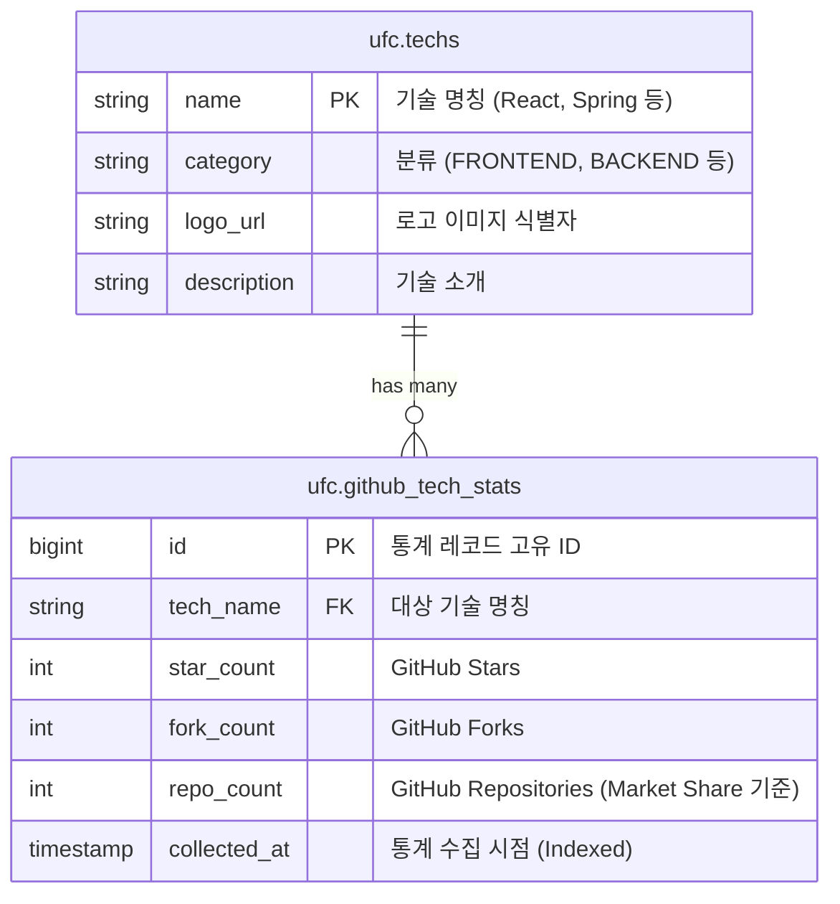

# 🥊 Ultimate Framework Championship (UFC)

UFC는 전 세계 다양한 프로그래밍 프레임워크와 기술 트렌드를 실시간으로 수집하고, 그 지표를 시각화하여 제공하는 오픈 테크 인사이트 플랫폼입니다.

---

## 🚀 기술 스택

### Backend


- **Framework**: Java 21, Spring Boot 4.x
- **Data Pipeline**: Spring Batch 6.x
- **Database**: PostgreSQL (Supabase)
- **Cache**: Redis (Upstash)

### Frontend


- **Framework**: Next.js (App Router), React 18
- **Language**: TypeScript
- **Styling**: Tailwind CSS
- **Visualization**: Chart.js, Framer Motion

### DevOps


---

## ✨ 주요 데이터 파이프라인 및 핵심 기술

**1. GitHub API 자동 수집 및 Batch Processing (`Spring Batch 6.x`)**
- 매시간 GitHub REST API를 호출하여 기술별 Stars, Forks, Repositories 데이터를 수집합니다.
- Spring Boot 4의 생태계에 맞춰 최신 `Spring Batch 6.x`를 도입, 레거시 저장소를 걷어내고 가장 안정적인 `Chunk Processing`을 통해 대량의 통계 데이터를 처리합니다.

**2. Java 21 Virtual Threads (가상 스레드) 최적화**
- 네이티브로 지원하는 **Virtual Threads**를 스케줄링 및 배치 프로세스에 결합했습니다. OS 스레드 고갈 걱정 없이 수십 개의 수집 I/O 작업들을 극도로 가볍게 비동기 병렬 처리하여 자원 효율성을 크게 최적화했습니다.

**3. 데이터 선형 보간 (Linear Interpolation) 및 복잡한 통계 쿼리 최적화**
- 최신 Jakarta EE 호환 `QueryDSL 5.1`을 사용하여 안전한 Type-Safe 쿼리를 작성했습니다. 누락된 시간대의 데이터를 예측하여 선형 보간(Linear Interpolation)하거나, 실시간 랭킹을 추출하는 등 복잡한 비즈니스 로직을 자바 코드 레벨에서 안전하고 우아하게 제어합니다.

**4. API 응답 캐싱 (Redis)**
- 동일한 통계 데이터를 매번 DB에서 집계하지 않도록, `Spring Cache`와 Upstash Redis를 연계해 API 응답 속도를 최적화했습니다.

**5. 무중단 헬스체크 인프라 (`Spring Actuator` & `Security`)**
- Render.com(또는 등급 서버) 환경에서의 무중단 배포를 위해 `/actuator/health` 엔드포인트를 열어두고, 이를 Spring Security로 보호/허용 처리하는 세밀한 헬스체크 인프라를 구축했습니다.

**6. 인터랙티브 데이터 시각화**
- 카테고리 전환 시 Framer Motion을 사용하여 부드러운 상태 보간 및 애니메이션을 제공합니다.
- 차트 데이터 포인트나 랭킹 리스트 아이템에 Hover 시 해당 지표(`Market Share`, `Stars`, `Forks`)를 실시간으로 중앙에 동기화하여 표시합니다.

**7. OpenAPI 3.0 (Swagger) 기반 API 자동 문서화**
- `springdoc-openapi`를 활용하여 별도의 수동 작업 없이 프론트엔드-백엔드 간 API 스펙 명세서를 자동화하고, 직관적인 Swagger UI 환경을 연동했습니다.

**8. GitHub API 예외 처리 및 회복 탄력성 (Resilience)**
- 구형 `RestTemplate` 대신 최신 **Fluent API 기반 `RestClient`**를 적극 도입했습니다. 이를 통해 `422 Unprocessable Content` 및 Rate Limit 초과 등 외부 API 통신 중 발생할 수 있는 오류에 대응하는 커스텀 방어 및 재시도 로직을 직관적으로 구현했습니다.

**9. 시계열 데이터 정합성 보장 (Time-Series Data Normalization)**
- 수집 주기(Hour)와 조회 기준(Minute) 간의 시간차로 생길 수 있는 데이터 불일치 문제를 해결하기 위해 백엔드 서비스 레이어에서 시간 절사(Truncation) 체계를 단일화했습니다.

**10. CORS 및 Security API 엔드포인트 세분화**
- 프론트엔드의 접근은 허용하면서도, Health Check(`/actuator/health`)와 API 엔드포인트별 보안 정책(Spring Security)을 세밀하게 분리하여 클라우드 인프라 요건과 보안성을 함께 충족했습니다.

**11. Supabase PostgreSQL 기반 고가용성 데이터 저장소**
- 클라우드 네이티브 환경의 Supabase를 활용하여 방대한 시계열(Time-Series) 프레임워크 통계 데이터를 안전하게 관리하며, 빠른 조회를 위한 스키마 및 인덱스 최적화를 적용했습니다.

**12. 동적 테마 색상 보정 (Adaptive Color Luminance)**
- 라이트/다크 모드 전환 시 기술별 고유 HEX 색상의 밝기(Luminance)를 동적으로 계산합니다. 배경색과 대비가 부족해 가독성이 떨어지는 색상(예: 화이트 모드에서의 노란색, 다크 모드에서의 남색)은 HSL 채도를 유지한 채 명도만 자동으로 보정하여 어느 테마에서나 완벽한 가독성을 보장합니다.

---

## 🗄️ 데이터베이스 스키마 (Database Structure)

본 프로젝트는 PostgreSQL(Supabase) 내 `ufc` 스키마를 사용하여 핵심 데이터를 분리·관리합니다.



- **`ufc.github_tech_stats`**: 매시간 Spring Batch에 의해 수집되는 기술별 통계 데이터가 누적되는 시계열 메인 테이블입니다.
- **`ufc.techs`**: 프론트엔드 환경에서 보여줄 각 기술의 분류 및 메타데이터를 관리합니다.

---

## 🛠️ 시작하기 (Local Setup)

### 1. 환경 변수 설정
`ufcback` 및 `ufcfront` 디렉토리에 각각 `.env`, `.env.local` 파일을 생성합니다.

**`ufcback/.env`**
```env
DB_URL=jdbc:postgresql://your-db-endpoint
DB_USERNAME=postgres
DB_PASSWORD=your-password
GITHUB_TOKEN=ghp_your_token
REDIS_HOST=your-redis-host
REDIS_PORT=your-redis-port
REDIS_PASSWORD=your-redis-password
```

**`ufcfront/.env.local`**
```env
NEXT_PUBLIC_API_URL=http://localhost:8080/api
```

### 2. 프로젝트 실행

**Backend**
```bash
cd ufcback
./gradlew clean bootRun
```

**Frontend**
```bash
cd ufcfront
npm install
npm run dev
```

---

## 🔗 관련 링크

- **Backend (API)**: https://ultimate-framework-championship.onrender.com
- **Frontend (Web)**: https://ultimate-framework-championship.vercel.app
- **Swagger UI**: https://ultimate-framework-championship.onrender.com/swagger-ui.html
